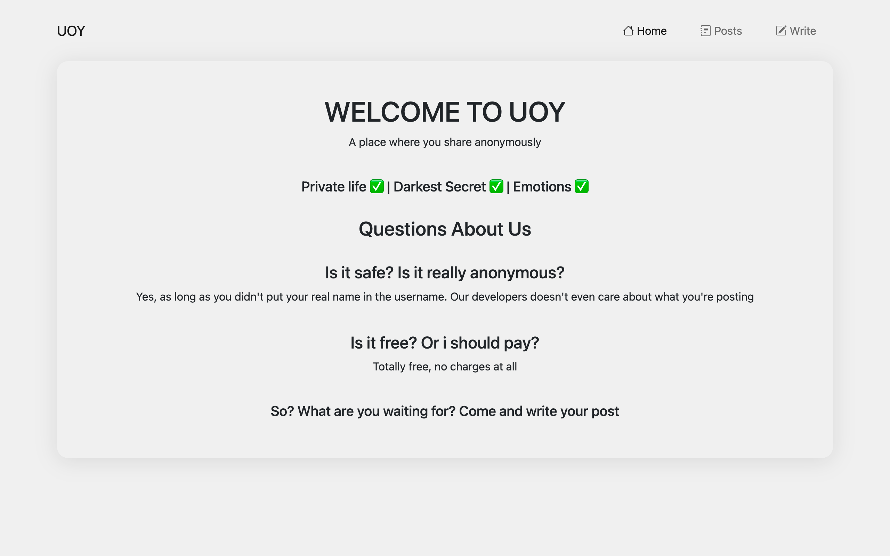

<p align="center">
  
</p>

## About Project

UOY is a web application where you can share anything anonymously for free and it is secure. It is built with :

- HTML
- CSS
- Bootstrap
- Laravel
- MySQL

It is hosted on https://uoy.rf.gd

Hosted since September 1st 2022 on InfinityFree Web Hosting

<br>

## Using Project

- Execute this line

```bash
  git clone https://github.com/CalvinTan68/UOY---Anonymous-Chat.git
```

- After that 

```bash
  cd UOY---Anonymous-Chat
```

- Create .env file by using .env.example file, rename it by deleting the ".example" filename

- Run command 

```bash
  php artisan serve
```
